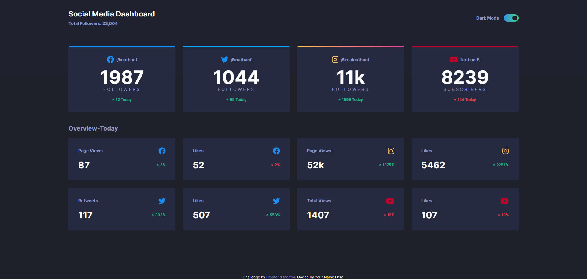

# Frontend Mentor - Social media dashboard solution

This is a solution to the [Social media dashboard challenge on Frontend Mentor](https://www.frontendmentor.io/challenges/social-media-dashboard-with-theme-switcher-6oY8ozp_H). Frontend Mentor challenges help you improve your coding skills by building realistic projects.

## Table of contents

- [Overview](#overview)
  - [The challenge](#the-challenge)
  - [Screenshot](#screenshot)
  - [Links](#links)
  - [Built with](#built-with)
  - [What I learned](#what-i-learned)
- [Author](#author)

## Overview

### The challenge

Users should be able to:

- View the optimal layout for the app depending on their device's screen size
- Change the mode of the dashboard from dark to light and vise versa
- Each one of the modes has its own background color and text colors
- The selected mode remains even if the user left the page or refreshed it

### Screenshot

### Links

- Live Site URL: [Demo](https://jahmd.github.io/Social_dedia_dashboard/)

### Built with

- Semantic HTML5 markup
- Tailwindcss
- CSS custom properties
- Flexbox
- CSS Grid
- Mobile-first workflow
- Dark and light mode
- Vanilla js

### What I learned

I learned while working through this project to practice my CSS knowledge and how to use tailwind css better than before and I learned that I should care about the readme file.

## Author

- Frontend Mentor - [@JAHMD](https://www.frontendmentor.io/profile/JAHMD)
- Twitter - [@Nrd_kirito](https://twitter.com/Nrd_kirito)
